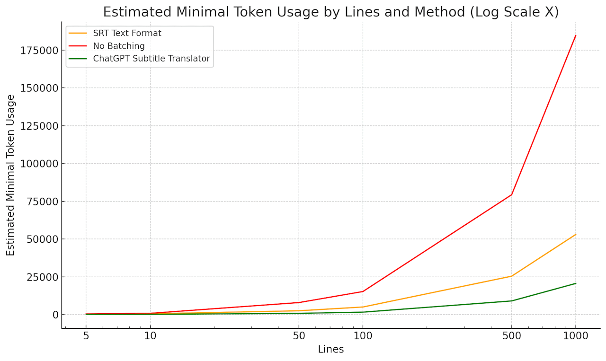

# ChatGPT API SRT Subtitle Translator
ChatGPT has also demonstrated its capabilities as a [robust translator](https://towardsdatascience.com/translate-with-chatgpt-f85609996a7f), capable of handling not just common languages, but also unconventional forms of writing like emojis and [word scrambling](https://www.mrc-cbu.cam.ac.uk/people/matt.davis/cmabridge/). However, it may not always produce a deterministic output and adhere to line-to-line correlation, potentially disrupting the timing of subtitles, even when instructed to follow precise instructions and setting the model `temperature` parameter to [`0`](https://cobusgreyling.medium.com/example-code-implementation-considerations-for-gpt-3-5-turbo-chatml-whisper-e61f8703c5db).

This utility uses the OpenAI ChatGPT API to translate text, with a specific focus on line-based translation, especially for SRT subtitles. The translator optimizes token usage by removing SRT overhead, grouping text into batches, resulting in arbitrary length translations without excessive [token consumption](https://openai.com/api/pricing/) while ensuring a one-to-one match between line input and output.

## Web Interface: <https://cerlancism.github.io/chatgpt-subtitle-translator>  

## Features
- Web User Interface (Web UI) and Command Line Interface (CLI)  
- **New**: Supports [Structured Output](https://openai.com/index/introducing-structured-outputs-in-the-api/): for more concise results, available in the Web UI and in CLI with `--experimental-structured-mode`.
- **New**: Supports [Prompt Caching](https://openai.com/index/api-prompt-caching/): by including the full context of translated data, the system instruction and translation context are packaged to work well with prompt caching, enabled with `--experimental-use-full-context` (CLI only).
- Supports any OpenAI API compatible providers such as running [Ollama](https://ollama.com/) locally
- Line-based batching: avoiding token limit per request, reducing overhead token wastage, maintaining translation context to certain extent  
- Checking with the free OpenAI Moderation tool: prevent token wastage if the model is highly likely to refuse to translate  
- Streaming process output  
- Request per minute (RPM) [rate limits](https://platform.openai.com/docs/guides/rate-limits/overview)  
- Progress resumption (CLI  Only)  


## Setup
Reference: <https://github.com/openai/openai-quickstart-node#setup>
- Node.js version `>= 16.13.0` required. This README assumes `bash` shell environment
- Clone this repository and 
  ```bash
  git clone https://github.com/Cerlancism/chatgpt-subtitle-translator
  ``` 
- Navigate into the directory
  ```bash
  cd chatgpt-subtitle-translator
  ```
- Install the requirements
  ```bash
  npm install
  ```
- Give executable permission
  ```bash
  chmod +x cli/translator.mjs
  ```
- Copy `.example.env` to `.env`
  ```bash
  cp .env.example .env
  ```
- Add your [API key](https://platform.openai.com/account/api-keys) to the newly created `.env` file
  - (Optional) Set rate limits: <https://platform.openai.com/docs/guides/rate-limits/overview>
## CLI
```
cli/translator.mjs --help
```

`Usage: translator [options]`

`Translation tool based on ChatGPT API`


Options:
  - `--from <language>`  
    Source language (default: "") 
  - `--to <language>`  
    Target language (default: "English")
  - `-i, --input <file>`  
    Input source text with the content of this file, in `.srt` format or plain text
  - `-o, --output <file>`  
    Output file name, defaults to be based on input file name
  - `-p, --plain-text <text>`  
    Input source text with this plain text argument
  - `-s, --system-instruction <instruction>`  
    Override the prompt system instruction template `Translate ${from} to ${to}` with this plain text, ignoring `--from` and `--to` options
  - `--initial-prompts <prompts>`  
    Initial prompts for the translation in JSON (default: `"[]"`) 
  - `--no-use-moderator`  
    Don't use the OpenAI API Moderation endpoint
  - `--moderation-model`  
    (default: `"omni-moderation-latest"`) https://platform.openai.com/docs/models/moderation
  - `--no-prefix-number`  
    Don't prefix lines with numerical indices
  - `--no-line-matching`  
    Don't enforce one to one line quantity input output matching
  - `-l, --history-prompt-length <length>`  
    Length of prompt history to retain for next request batch (default: 10)
  - `-b, --batch-sizes <sizes>` 
    Batch sizes of increasing order for translation prompt slices in JSON Array (default: `"[10,100]"`)  

    The number of lines to include in each translation prompt, provided that they are estimated to within the token limit. 
    In case of mismatched output line quantities, this number will be decreased step-by-step according to the values in the array, ultimately reaching one.
    
    Larger batch sizes generally lead to more efficient token utilization and potentially better contextual translation. 
    However, mismatched output line quantities or exceeding the token limit will cause token wastage, requiring resubmission of the batch with a smaller batch size.
  - `--experimental-structured-mode [mode]`  
    Enable [structured response](https://openai.com/index/introducing-structured-outputs-in-the-api/). (default: `array`, choices `array`)
      - `--experimental-structured-mode array` Structures the input and output into a plain array format. This option is more concise compared to base mode, though it uses slightly more tokens per batch.

  - `--experimental-use-full-context`  
    Include the full context of translated data to work well with [prompt caching](https://openai.com/index/api-prompt-caching/).  
    
    The translated lines per user and assistant message pairs are sliced as defined by `--history-prompt-length` (by default `--history-prompt-length 10`), it is recommended to set this to the largest batch size (by default `--batch-sizes "[10,100]"`): `--history-prompt-length 100`.  
    
    Enabling this may risk running into the model's context window limit, typically `128K`, but should be sufficient for most cases.
  - `--log-level <level>`  
    Log level (default: `debug`, choices: `trace`, `debug`, `info`, `warn`, `error`, `silent`)
  - `--silent`  
    Same as `--log-level silent`  
  - `--quiet`  
    Same as `--log-level silent`  

Additional Options for GPT:  
  - `-m, --model <model>`  
    (default: `"gpt-4o-mini"`) https://platform.openai.com/docs/api-reference/chat/create
  - `--stream`  
    Stream progress output to terminal https://platform.openai.com/docs/api-reference/chat/create#chat-create-stream
  - `-t, --temperature <temperature>`  
    Sampling temperature to use, should set a low value below `0.3` to be more deterministic for translation (default: `1`) https://platform.openai.com/docs/api-reference/chat/create#chat-create-temperature
  - `--top_p <top_p>`  
    Nucleus sampling parameter, top_p probability mass https://platform.openai.com/docs/api-reference/chat/create#chat-create-top_p
  - `--presence_penalty <presence_penalty>`  
    Penalty for new tokens based on their presence in the text so far https://platform.openai.com/docs/api-reference/chat/create#chat-create-presence_penalty
  - `--frequency_penalty <frequency_penalty`  
    Penalty for new tokens based on their frequency in the text so far https://platform.openai.com/docs/api-reference/chat/create#chat-create-frequency_penalty
  - `--logit_bias <logit_bias>`  
    Modify the likelihood of specified tokens appearing in the completion https://platform.openai.com/docs/api-reference/chat/create#chat-create-logit_bias


## Examples
### Plain text  
```bash
cli/translator.mjs --plain-text "你好"
```
Standard Output
```
Hello.
```
### Emojis
```bash
cli/translator.mjs --stream --to "Emojis" --temperature 0 --plain-text "$(curl 'https://api.chucknorris.io/jokes/0ECUwLDTTYSaeFCq6YMa5A' | jq .value)"
```  
Input Argument
```
Chuck Norris can walk with the animals, talk with the animals; grunt and squeak and squawk with the animals... and the animals, without fail, always say 'yessir Mr. Norris'.
```
Standard Output
```
👨‍🦰💪🚶‍♂️🦜🐒🐘🐅🐆🐎🐖🐄🐑🦏🐊🐢🐍🐿️🐇🐿️❗️🌳💬😲👉🤵👨‍🦰👊=🐕🐑🐐🦌🐘🦏🦍🦧🦓🐅🦌🦌🦌🐆🦍🐘🐘🐗🦓=👍🤵.
```
### Scrambling
```bash
cli/translator.mjs --stream --system-instruction "Scramble characters of words while only keeping the start and end letter" --no-prefix-number --no-line-matching --temperature 0 --plain-text "Chuck Norris can walk with the animals, talk with the animals;"
```
Standard Output
```
Cuhck Nroris can wakl wtih the aiamnls, talk wtih the aiamnls;
```  
### Unscrabling
```bash
cli/translator.mjs --stream --system-instruction "Unscramble characters back to English" --no-prefix-number --no-line-matching --temperature 0 --plain-text "Cuhck Nroris can wakl wtih the aiamnls, talk wtih the aiamnls;"
```
Standard Output
```
Chuck Norris can walk with the animals, talk with the animals;
```

### Plain text file  
```bash
cli/translator.mjs --stream --temperature 0 --input test/data/test_cn.txt
```  
Input file: [test/data/test_cn.txt](test/data/test_cn.txt)
```
你好。
拜拜！
```
Standard Output
```
Hello.  
Goodbye!
```
### SRT file
```bash
cli/translator.mjs --stream --temperature 0 --input test/data/test_ja_small.srt
```  
Input file: [test/data/test_ja_small.srt](test/data/test_ja_small.srt)
```srt
1
00:00:00,000 --> 00:00:02,000
おはようございます。

2
00:00:02,000 --> 00:00:05,000
お元気ですか？

3
00:00:05,000 --> 00:00:07,000
はい、元気です。

4
00:00:08,000 --> 00:00:12,000
今日は天気がいいですね。

5
00:00:12,000 --> 00:00:16,000
はい、とてもいい天気です。
``` 
Output file: [test/data/test_ja_small.srt.out_English.srt](test/data/test_ja_small.srt.out_English.srt)
```srt
1
00:00:00,000 --> 00:00:02,000
Good morning.

2
00:00:02,000 --> 00:00:05,000
How are you?

3
00:00:05,000 --> 00:00:07,000
Yes, I'm doing well.

4
00:00:08,000 --> 00:00:12,000
The weather is nice today, isn't it?

5
00:00:12,000 --> 00:00:16,000
Yes, it's very nice weather.
```

## How it works
### Token Reductions
**System Instruction**  
Tokens: `4`
```
Translate to English
```  
<table>
<tr>
<th>Input</th>
<th>Prompt</th>
<th>Transform</th>
<th>Output</th>
</tr>
<tr>
<td>

Tokens: `127`

</td>
<td>

Tokens: `45`

</td>
<td>

Tokens: `39`

</td>
<td>

Tokens: `124`

</td>
</tr>
<tr>
<td valign="top">

```srt
1
00:00:00,000 --> 00:00:02,000
おはようございます。

2
00:00:02,000 --> 00:00:05,000
お元気ですか？

3
00:00:05,000 --> 00:00:07,000
はい、元気です。

4
00:00:08,000 --> 00:00:12,000
今日は天気がいいですね。

5
00:00:12,000 --> 00:00:16,000
はい、とてもいい天気です。
```

</td>
<td valign="top">

```log
1. おはようございます。
2. お元気ですか？
3. はい、元気です。
4. 今日は天気がいいですね。
5. はい、とてもいい天気です。
```

</td>
<td valign="top">

```log
1. Good morning.
2. How are you?
3. Yes, I'm doing well.
4. The weather is nice today, isn't it?
5. Yes, it's very nice weather.
```

</td>
<td valign="top">

```srt
1
00:00:00,000 --> 00:00:02,000
Good morning.

2
00:00:02,000 --> 00:00:05,000
How are you?

3
00:00:05,000 --> 00:00:07,000
Yes, I'm doing well.

4
00:00:08,000 --> 00:00:12,000
The weather is nice today, isn't it?

5
00:00:12,000 --> 00:00:16,000
Yes, it's very nice weather.
```

</td>
</tr>
</table>

### Token Estimated Usage Analysis and Comparison
| Lines | SRT Text Format | No Batching | ChatGPT Subtitle Translator |
|-------|-----------------|-------------|-----------------------------|
| 5     | 280             | 469         | 133                         |
| 10    | 511             | 834         | 171                         |
| 50    | 2,518           | 7,944       | 818                         |
| 100   | 5,011           | 15,263      | 1,611                       |
| 500   | 25,400          | 79,297      | 9,025                       |
| 1000  | 52,988          | 184,596     | 20,593                      |

*Test data can be found in [test/data](./test/data) directory. Token count also roughly included chat structure and prime token overheads*



**SRT Text Format**: Full SRT text format including timestamps for input/output  
**No Batching**: SRT formating and timestamps stripping, but one line per prompt with system instruction overhead, including up to `10` historical data for context per prompt  
**ChatGPT Subtitle Translator**: SRT formating and timestamps stripping, line batching of `100`, including up to `10` historical data for context per batch

*This analysis assumes perfect input/output quantity matching. In reality, this depends on model and subtitle quality. Typically, buffer an additional 20%~30% token usage for retries, refer to the `--batch-sizes` CLI option.*
